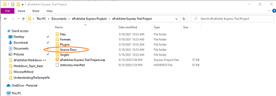
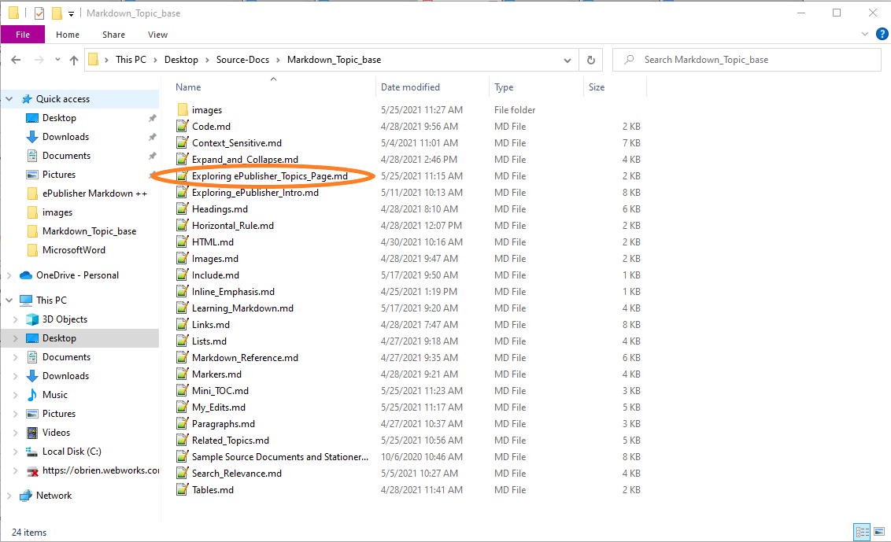

WebWorks dedicates time and resources to understanding technologies and devices that content is created on and
delivered too. As we come to understand these elements, we develop features in our product to help our users take
advantage of the new technology. You will find that **ePublisher** can add rich HTML features to your output by
simply assigning the proper [Custom Style Name](#Custom-Style-Names) to the proper heading.  One of these features is Mini Table of
Contents. 

# Creating a Mini Table of Contents  

A Mini Table of Contents appears underneath a title and lists the subheading in the section, providing a link to each. These are great for outputs without traditional Table of Contents and idea for smaller screens. 

<!--style:ProcedureTitle-->
To Create a Mini Table of Contents 

1. Locate your topic heading. 
1. Apply the [Custom Style Name](#Custom-Style-Names) that applies the **Mini Table of Contents** feature. This custom style name has been   associated with the mini table of contents feature in the stationery.  
1. Save the document
1. Use **ePublisher** to generate output. 
1. Locate the section in the output to verify the mini Table of Contents. 

<!--style: Heading 1 Relevance; #creating-your-first-mini-table-of-contents-->
# Creating Your First Mini Table of Contents

In this example, you are going to add the custom style name "mini_toc" to the heading of this section "Mini Table of
Contents for Mobile Devices". Adding this style will add a mini Table of Contents underneath this title in the
generated output. The mini Table of Contents is a good way for a content creator to increase the navigation features
of their output for a mobile user, or a quick way to jump to sections within a topic. 

<!--style:ProcedureTitle-->
To Create Your First Mini Table of Contents 

1. In the Source Documents Folder, look for the Markdown document `Exploring ePublisher_Topics_Page.md`.

   
1. Double click on the document to open the file in a text editor.

     
1. Find the Title "Mini Table of Contents".
1. Add the Custom Style Name `mini_toc` before the `markers:` element so it looks like the example below: 
   
   `<!--style: mini_toc; markers: {"Keywords": "MiniToc, Multiple Devices, ePublisher Features"}; #minitoc-->`  
1. Save this source document
1. Generate output using **ePublisher Express Trial** project. 
1. Navigate to the section "Mini Table of Contents" in the generated output and verify the mini Table of Contents
   does appear below the section title. 
1. Return to the **ePublisher** **Express** Trial Guide to continue.

Yep, it is that easy. This feature was enabled in the stationery using **ePublisher Designer**. The only difference
between this title and the other titles in the source document is that **ePublisher** sees the command to generate a
mini Table of Contents after this topic. This gives the content creator the ability to place a mini Table of
Contents on any title they choose, simply by labeling it with the correct custom style name. 
