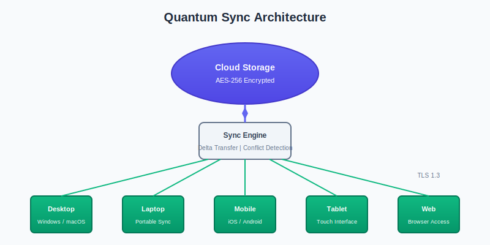

<!-- markers:{"Keywords": "quantum sync, overview, cloud storage, file synchronization, benefits, architecture", "Description": "Learn what Quantum Sync is and why it is the ideal solution for cloud file synchronization.", "IndexMarker": "cloud synchronization"}; #overview -->
## Overview

[overview]: #overview "Overview"

$ProductName; is a next-generation cloud synchronization service designed for teams and individuals who need reliable, secure file access across all their devices. Built with **enterprise-grade security** and *consumer-friendly simplicity*, $ProductName; bridges the gap between powerful functionality and ease of use.

Whether you are a solo professional managing documents across laptops and tablets, or an enterprise IT administrator deploying to thousands of users, $ProductName; adapts to your workflow. Our intelligent sync engine detects changes in real time and propagates them across your connected devices with minimal bandwidth usage.

<!-- #key-benefits -->
### Key Benefits

[key-benefits]: #key-benefits "Key Benefits"

$ProductName; offers several advantages over traditional file synchronization solutions:

- **Real-time synchronization** — Changes appear on all devices within seconds, not minutes
- **Intelligent conflict resolution** — When the same file is edited on multiple devices, $ProductName; preserves both versions and helps you merge changes
- **Enterprise-grade encryption** — All files are encrypted ***in transit and at rest*** using AES-256 encryption
- **Cross-platform support** — Native applications for Windows, macOS, Linux, iOS, and Android
- **Selective sync** — Choose which folders to sync on each device to conserve storage space
- ~~Legacy FTP uploads~~ — Replaced by the modern sync engine in $ProductName; $Version;

<!-- marker:IndexMarker="real-time synchronization" ; #real-time-performance -->
#### Real-Time Performance

[real-time-performance]: #real-time-performance "Real-Time Performance"

Unlike polling-based sync services that check for changes every few minutes, $ProductName; uses a persistent connection to detect file changes the moment they happen. The sync engine uses `delta compression` to transmit only the bytes that changed, reducing bandwidth by up to 90% compared to full-file transfers.

<!-- marker:IndexMarker="encryption:AES-256,security:overview" ; #security-model -->
#### Security Model

[security-model]: #security-model "Security Model"

Every file is encrypted with AES-256 before leaving your device. During transfer, TLS 1.3 protects data in transit. For organizations with strict compliance requirements, $ProductName; offers **zero-knowledge encryption** where even our servers cannot read your data.

<!-- #architecture -->
### Architecture

[architecture]: #architecture "Architecture"

$ProductName; uses a distributed architecture with regional data centers to ensure low latency and high availability. The diagram below illustrates how data flows through the system.

The architecture consists of three tiers:

1. **Client tier** — Desktop and mobile applications that monitor local file changes
2. **Edge tier** — Regional relay servers that route traffic to the nearest data center
3. **Storage tier** — Distributed cloud storage with automatic replication

For detailed information about specific capabilities, see the [Features][features] section. To configure $ProductName; for your environment, see the [Settings][settings] section.

<!--
  Cross-file slug definitions (pattern-file artifact).

  The Designer Trial source docs are pattern files for modular development.
  Each topic file is registered as a separate source document in the .wep, not
  assembled via includes. So `[Text][slug]` cross-references need each outgoing
  slug defined locally per CommonMark scope rules. In a production setup where
  topic files are assembled via include directives, these local defs would not
  be needed — each target file's triple already places the slug in
  document-global scope after Phase 1 assembly. Maintaining this block by hand
  is not the expected real-world workflow.
-->

[features]: tables.md#features "Features"
[settings]: conditions-and-variables.md#settings "Settings"
