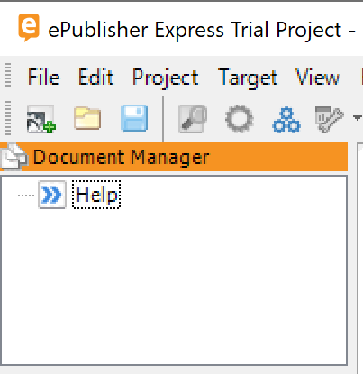

<!-- markers:{"Keywords": "trial, getting started, quick start, ePublisher Express", "Description": "First-time user introduction to ePublisher Express"}; #quick-start -->
# Quick Start

Generate your first professional HTML5 output in 3 clicks.

<!-- #add-documents -->
## Step 1: Add Documents

The **ePublisher Express Trial Project** opens automatically on first launch.

> **Returning user?** Choose **File > Open** and navigate to:
> `Documents\ePublisher Express Projects\ePublisher Express Trial Project\ePublisher Express Trial Project.wrp`

Add the sample source document to the Document Manager:

1. Click **View** > **Project Directory**
2. Open `Source-Docs`
3. Drag `quantum-sync.md` to the Document Manager

> **Tip:** This single file includes all the sample topics. Markdown++ uses `<!--include:-->` directives to compose documents.

<!-- #generate -->
## Step 2: Generate

1. Verify the **Active Target** shows **WebWorks Reverb 2.0**
2. Click **Generate All**
3. Watch the log as ePublisher processes your documents
4. When the completion dialog appears, click **Yes** to view your output

Your output opens automatically in your default browser. Here's what you get:

| Feature        | What You Get                            |
|----------------|-----------------------------------------|
| **Search**     | Instant answers with breadcrumb context |
| **Responsive** | Perfect reading on any device           |
| **Share**      | Direct links to any page                |
| **Images**     | Click-to-zoom for details               |
| **PDF**        | One-click format switching              |

<!-- condition:show_ai_features -->
**AI-Ready:** Your output includes Landmark IDs for deep-linking and a parallel Knowledge Base for AI integration.
<!-- /condition -->

<!-- #done -->
## Done

You've created professional documentation from Markdown in under 5 minutes.

**Ready for more?** [Download ePublisher Designer](https://webworks.com/products/epublisher/download) to unlock full customization of colors, layouts, and branding.

[Full documentation](https://static.webworks.com/docs/epublisher/latest/help/) | [Contact sales](mailto:sales@webworks.com)

---

<!-- #explore-more -->
## Explore More (Optional)

### Customize Output Behavior

ePublisher Express includes configurable Target Settings. Access them via **Target** > **Target Settings**.

| Setting     | What It Controls                          |
|-------------|-------------------------------------------|
| **Header**  | Logo, navigation bar, search placement    |
| **Footer**  | Copyright text, links, contact info       |
| **Tabs**    | Top navigation categories and groupings   |

### Take Full Control with Designer

[Download ePublisher Designer](https://webworks.com/products/epublisher/download) for complete customization of your Reverb skin, including typography, color schemes, and page layouts. Designer installs alongside Express and gives you pixel-level control over every element of your output. Choose 32-bit or 64-bit Windows on the download page.

### Automate with AutoMap

[Download ePublisher AutoMap](https://webworks.com/products/epublisher/download) to integrate documentation builds into your CI/CD pipeline. AutoMap works with your existing Express installation to enable automated publishing workflows, scheduled regeneration, and hands-free deployment.
