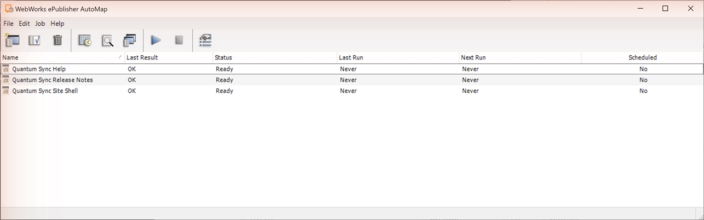
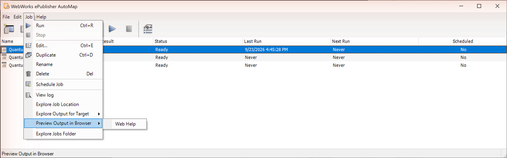
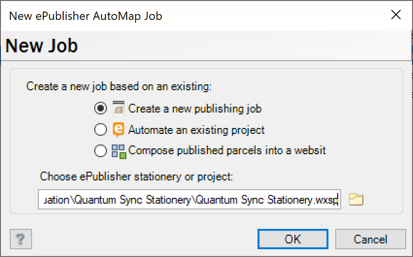
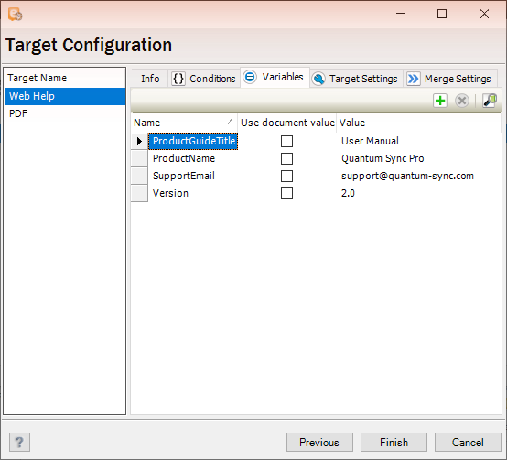
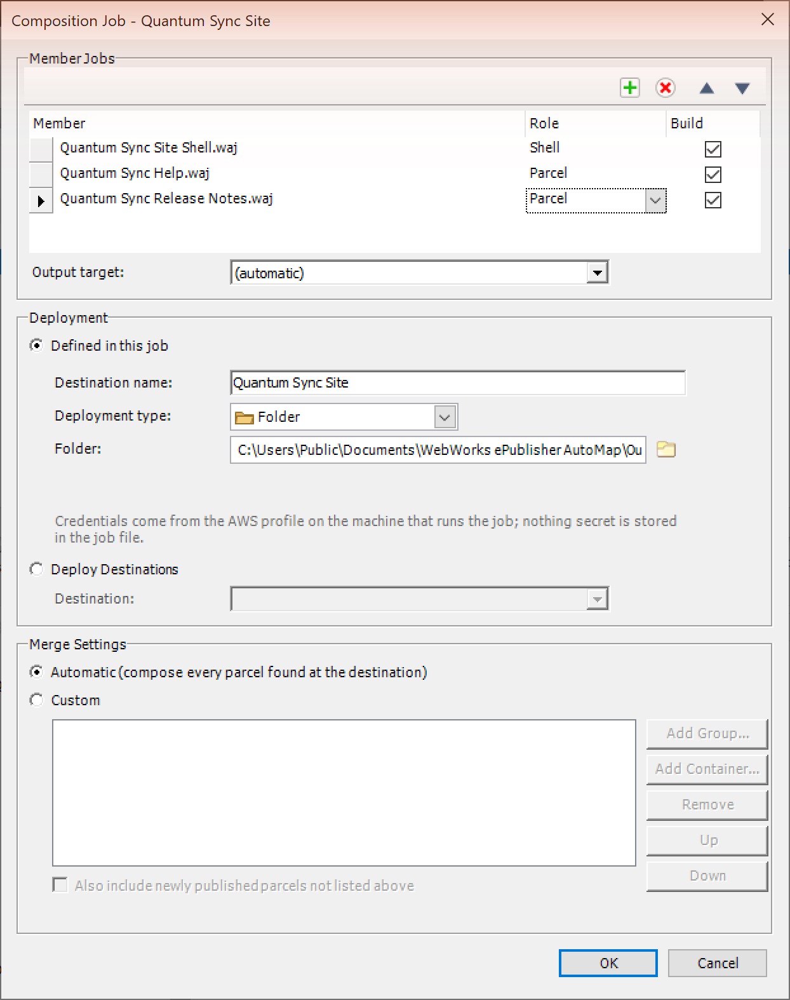
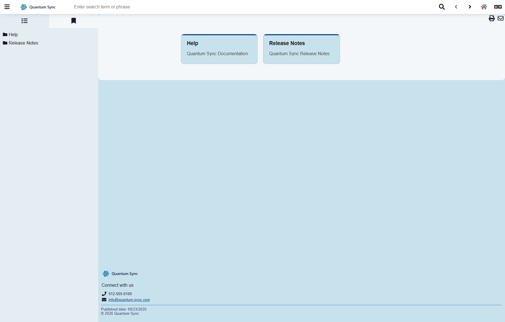
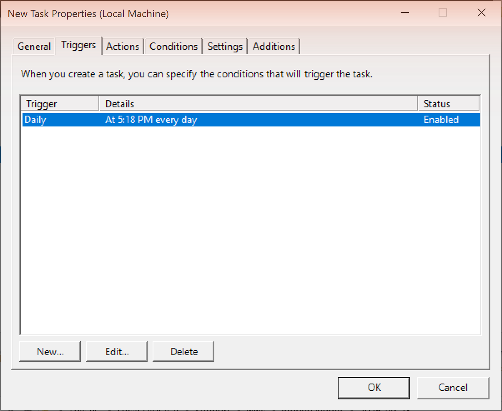
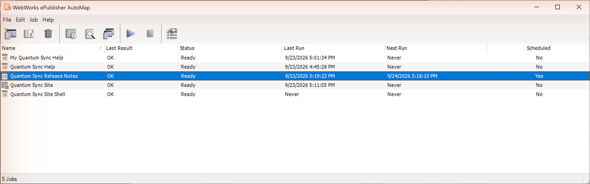
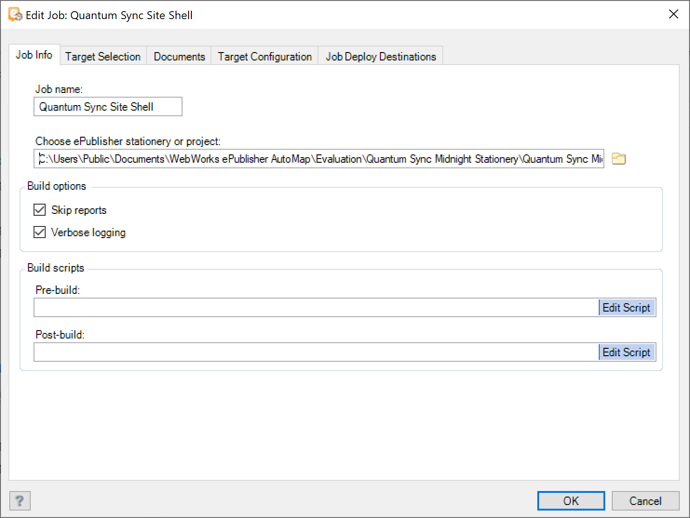
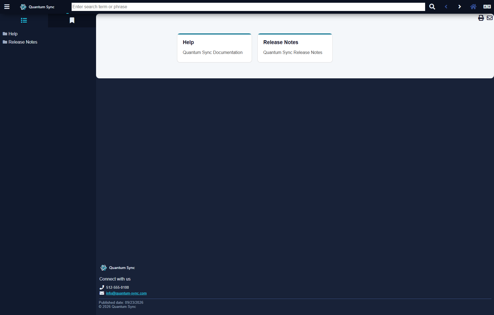

<!-- #quick-start -->
# Quick Start

AutoMap publishes and assembles documentation sites from jobs you can run, schedule and compose, without a designer at the keyboard (Markdown++ sources here; DITA, FrameMaker and Word work the same way).

> **Where things live:** Everything the trial uses is in your Documents folder under `WebWorks ePublisher AutoMap`: `Jobs`, `Evaluation`, and, after your first run, `Output`. Windows may show Documents under a localized name or inside OneDrive; the Administrator's own commands take you to the right place.

<!-- #run-a-publication -->
## Step 1: Run a Publication

Publishing should be a button, not a project. Run a seeded job to see the complete path from job list to published site.

1. Open **WebWorks ePublisher AutoMap Administrator** (**Start** > **WebWorks** > **ePublisher AutoMap**). The job list already holds the three seeded jobs, **Quantum Sync Help**, **Quantum Sync Release Notes**, and **Quantum Sync Site Shell**; none has run yet (**Last Run** reads **Never**).
2. Select **Quantum Sync Help** and choose **Job** > **Run**. When Windows opens the scheduled-task properties (AutoMap runs each job as a scheduled task), click **OK** to accept the defaults. A console window shows the build; when **Status** returns to **Ready**, **Last Run** shows the time and **Last Result** reads **OK** (a minute or two).
3. Choose **Job** > **View log**. The log ends `0 warning(s), 0 error(s) reported.`.
4. Choose **Job** > **Preview Output in Browser** > **Web Help** to open the Quantum Sync help site. Then choose **Job** > **Explore Output for Target** > **Web Help** to open `Documents\WebWorks ePublisher AutoMap\Output\Quantum Sync Help`.

<!-- style:Screenshot -->


<!-- style:Screenshot -->


> **Tip:** **Quantum Sync Release Notes** is the job that changes often; Step 4 makes it run itself.

<!-- #create-a-publishing-job -->
## Step 2: Create a Publishing Job

Hand-building the same publication every release is where the hours go. A publishing job captures it once: a Stationery (the design) plus the documents it publishes.

1. Choose **File** > **New Job**. In **New ePublisher AutoMap Job**, choose **Create a new publishing job**; under **Choose ePublisher stationery or project:** browse to `Documents\WebWorks ePublisher AutoMap\Evaluation\Quantum Sync Stationery\Quantum Sync Stationery.wxsp`; click **OK**.
2. On **Job Info**, set **Job name:** to **My Quantum Sync Help**. Click **Next**.
3. On **Documents**, click **New Group** and name it **Help**; click **Add Document** and add `Documents\WebWorks ePublisher AutoMap\Evaluation\Quantum Sync Source Docs\quantum-sync.md`. Click **Next**.
4. On **Target Selection**, leave **Build** checked for **Web Help** and clear it for **PDF**. The Stationery carries both; one is enough for now (leaving PDF on is harmless, only slower). Click **Next**.
5. On **Target Configuration**, **Web Help** is selected in the target list and the **Info** tab is showing. Under **Deployment**, click **Deploy Destinations...**, then **Add** > **Folder**. Set **Name:** to **My Quantum Sync Help** and **Directory:** to `Documents\WebWorks ePublisher AutoMap\Output\My Quantum Sync Help`; click **OK**, then **OK** again.
6. Pick **My Quantum Sync Help** under **Deploy to:**. AutoMap will not let you leave the **Info** tab until a built target has a destination; the message reads "Please select an output location."
7. Select the **Variables** tab; double-click the value of `ProductName` and change it from **Quantum Sync** to **Quantum Sync Pro**. The override belongs to this job and this target; the Stationery is untouched. Click **Finish**. When the scheduled-task properties open, click **OK**.
8. Choose **Job** > **Run**, then **Job** > **Preview Output in Browser** > **Web Help**. The site now says Quantum Sync Pro.

<!-- style:Screenshot -->


<!-- style:Screenshot -->


**Conditions** and **Target Settings** on the same page override the Stationery per target the same way.

<!-- #compose-a-site -->
## Step 3: Compose a Site

One site can combine publications that build on their own cadence: the shell brings the chrome, and the parcels bring content.

1. Choose **File** > **New Job**, choose **Compose published parcels into a website (Composition Job)**, and click **OK**. A small prompt asks for a name: enter **Quantum Sync Site** and click **OK**. The **Composition Job - Quantum Sync Site** editor opens.
2. Under **Member Jobs**, click the **Add** button (the green plus) and pick **Quantum Sync Site Shell**, then **Quantum Sync Help**, then **Quantum Sync Release Notes**; the members appear by file name.
3. Click each member's **Role** cell and set it: **Shell** for Quantum Sync Site Shell, **Parcel** for the other two (not **Infer**). Leave **Build** checked and **Output target** on **(automatic)**.
4. Set **Merge Settings** to **Automatic (compose every parcel found at the destination)**.
5. Set **Deployment** to **Defined in this job**, **Destination name:** **Quantum Sync Site**, **Deployment type:** **Folder**, and **Folder:** `Documents\WebWorks ePublisher AutoMap\Output\Quantum Sync Site`. Click **OK**.
6. Select **Quantum Sync Site** and choose **Job** > **Run**. Accept the scheduled-task properties with **OK** the first time. The three members build in turn, in about four minutes.
7. Choose **Job** > **Preview Output in Browser** > **Quantum Sync Site**. One site shows **Help** and **Release Notes** side by side in the contents (the parcels can take a moment to appear after the chrome loads).

<!-- style:Screenshot -->


<!-- style:Screenshot -->


<!-- #make-it-run-itself -->
## Step 4: Make It Run Itself

Release notes change every sprint; nobody should have to remember to republish them.

1. Select **Quantum Sync Release Notes** and choose **Job** > **Schedule Job**. The Windows scheduled-task properties open for this job (the window is titled **New Task Properties**).
2. On the **Triggers** tab, click **New...**. In **New Trigger**, keep **Begin the task** on **On a schedule**, select **Daily**, set a start time, and click **OK**; then click **OK** to close the task properties.
3. Back in the job list, **Scheduled** reads **Yes** and **Next Run** shows the next time. To see it run now, choose **Job** > **Run**; when it finishes, **Last Run** shows the time and **Last Result** reads **OK**.

<!-- style:Screenshot -->


<!-- style:Screenshot -->


> **Can't leave a recurring schedule in place?** Skip the trigger and use **Job** > **Run** whenever the release notes change; the result is the same publication, run by hand.

<!-- #re-skin-the-site -->
## Step 5: Re-skin the Site

The design lives in the Stationery, not in the jobs: point the three seeded jobs at **Quantum Sync Midnight Stationery** (the same design with midnight chrome), run the composition again, and every publication follows.

1. For each seeded job — **Quantum Sync Site Shell**, **Quantum Sync Help**, and **Quantum Sync Release Notes** — select it and choose **Job** > **Edit...**. On **Job Info**, under **Choose ePublisher stationery or project:** browse to `Documents\WebWorks ePublisher AutoMap\Evaluation\Quantum Sync Midnight Stationery\Quantum Sync Midnight Stationery.wxsp`; click **OK**. The field shows the full path of the current Stationery; replace it.
2. Select **Quantum Sync Site** and choose **Job** > **Run**.
3. Choose **Job** > **Preview Output in Browser** > **Quantum Sync Site**. The whole site now wears the midnight chrome (dark toolbar, sidebar and page frame, cyan accent); the content is unchanged.

<!-- style:Screenshot -->


<!-- #done -->
## Done

You ran, created, composed, scheduled, and re-skinned a documentation site without opening a design tool.

<!-- style:Screenshot -->


**Next:** [Download ePublisher Designer](https://webworks.com/products/epublisher/download) to create your own Stationery: your brand, your layouts, your output formats — or keep reading to understand what you just built.

[Full documentation](https://static.webworks.com/docs/epublisher/latest/help/) | [Contact sales](mailto:sales@webworks.com)

---

<!-- #explore-more -->
## Explore More

You have seen the whole loop; here is how the pieces fit and what else AutoMap does.

<!-- #what-you-just-did -->
### What You Just Did

The five steps map onto four ideas:

1. **Publishing job** (Steps 1 and 2) — a publication manifest: one recipe of Stationery, documents and per-target overrides that AutoMap runs on demand, on a schedule or from a pipeline
2. **Composition job** (Step 3) — assembles a site from the deployed output of its members: the shell brings the chrome, each parcel brings its content, and the combined contents are stitched from the parcels
3. **Schedule** (Step 4) — for high-velocity content, the parcel that changes every sprint
4. **Stationery** (Step 5) — the design lives there, not in the jobs, so re-pointing the jobs re-skins everything

In the trial every member had **Build** checked, so each composition run rebuilt all three jobs in about four minutes. In production, clear **Build** on the slow members and let each job publish on its own cadence: the composition then reads the deployed parcels, splices the combined contents and advances the site's cache key in seconds, without rebuilding the slow ones.

<!-- #deploy-s3-cloudfront -->
### Deploy to S3 + CloudFront

The trial deploys to folders; production deploys to Amazon S3 behind CloudFront, where the 2026.1 deploy features matter. This needs an AWS account, so it is not part of the trial:

- **Amazon S3 destinations** — **Edit** > **Deploy Destinations...** > **Add** > **Amazon S3**: **Bucket URI:**, **Region:**, **Credential profile:**, **CloudFront distribution:**; AutoMap stores no access keys, credentials come from the standard AWS credential chain
- **Built for caching** — versioned assets are cached immutably while pages and maps are always revalidated; each deploy invalidates its own pages, and each composition advances the site's cache key in one invalidation, so a re-skin or a new parcel reaches readers without a manual cache flush

<!-- #cli-ci -->
### CLI & CI

Everything the Administrator runs, the command line runs headless:

```
"C:\Program Files\WebWorks\ePublisher\2026.1\ePublisher AutoMap\WebWorks.Automap.exe" "<your Documents folder>\WebWorks ePublisher AutoMap\Jobs\Quantum Sync Help\Quantum Sync Help.waj"
```

- **Exit codes** — 0 on success, 1 on errors (warnings still exit 0), so a pipeline step fails when the build fails
- **Flags** — `-t` builds only the named targets, `-n` builds without deploying, `--skip-reports`, `--stagingdir`
- **Drop-in jobs** — a job is a folder, `Jobs\<name>\<name>.waj`, and the Administrator lists it the moment the job file lands there; a pipeline copies jobs into place with no import step
- **Version control** — job files are small XML with paths relative to the job and can carry their own deploy destination, as the seeded jobs do, so keep them beside the documents; ignore the `<name>-log.txt` next to each job

<!-- #scheduling-depth -->
### Scheduling Depth

Step 4 used the Windows Task Scheduler; AutoMap leans on it fully:

- **Run whether user is logged on or not** needs the Windows user name and password (`DOMAIN\user` on a domain); this is how a build server publishes unattended
- **Last Run Result** `0x0` means success and `0x1` errors; the Administrator shows the same as **Last Result** **OK** or **Error**
- **Job** > **Suspend Job Schedule** pauses a job without deleting its triggers; **Resume Job Schedule** brings it back
- `WebWorks.Automap.Administrator.restricted.bat` starts the Administrator without elevation; there you can create and configure jobs but not run or schedule them (both go through Task Scheduler), so build with the command line above instead

<!-- #scripts-build-options -->
### Scripts and Build Options

Jobs can run your scripts around the build:

- **Job Info** has **Pre-build:** and **Post-build:** scripts for the whole job, the **Info** tab of **Target Configuration** has the same pair per target, and each document group can have a **Script to retrieve documents:** that fetches sources first
- Scripts are batch files run from the job folder, with variables for the job name and folder, the target name and output folder, and the group name; the script editor lists them
- **Build options** on **Job Info**: **Skip reports** skips the QA reports and shortens large builds; **Verbose logging** (on by default) keeps step-by-step progress in the log

<!-- #try-ai-assistant -->
### Try This: AI Assistant

A Reverb site can carry an AI assistant that answers questions from the site's own content. It needs a free WebWorks Platform login, and here is what to expect:

1. Sign in to the [WebWorks Platform](https://platform.webworks.com) (free), create an assistant, and copy its **Assistant ID**
2. Select **Quantum Sync Help**, choose **Job** > **Edit...**, open **Target Configuration**, select **Web Help** in the target list, then the **Target Settings** tab; under **AI Features** set **Generate Assistant** to true, paste the ID into **Assistant ID**, leave **Hide AI Tab when file local** off, and click **OK**
3. Choose **Job** > **Run**, then **Job** > **Preview Output in Browser** > **Web Help**: the site has an AI tab
4. Ask it something. The chat returns an error, and that is expected: live answers need the output hosted on an Internet domain listed in the assistant's **Origin Domains**, and a local folder is not one

<!-- #try-custom-merge -->
### Try This: Custom Merge Settings

Automatic merge lists parcels as found; Custom lets you shape the combined contents:

1. Select **Quantum Sync Site** and choose **Job** > **Edit...**
2. Under **Merge Settings** choose **Custom**; click **Add Container...** and name it **Quantum Sync**; with the container selected, click **Add Group...** and add **Release Notes**, then again for **Help** (a container is a folder in the contents; only groups carry content)
3. Tick **Also include newly published parcels not listed above**, so a parcel you add later still appears after the declared ones
4. Click **OK**, choose **Job** > **Run**, and preview: Release Notes now leads, and both parcels sit under one folder in the contents

<!-- #vcs-cms -->
### Version Control and CMS

The per-group **Script to retrieve documents:** is the hook for pulling sources from Git, Subversion, Perforce, Mercurial or any command-line-scriptable VCS, and from CMSs such as Vasont and SDL LiveContent. See the [full documentation](https://static.webworks.com/docs/epublisher/latest/help/).

<!-- #product-family -->
### The ePublisher Product Family

| | **Express** | **Designer** | **AutoMap** |
|---|---|---|---|
| **Who it's for** | Authors publishing content | Teams controlling brand and design | DevOps automating builds |
| **What it does** | Generate output from Stationery | Create and customize Stationery | CLI and scheduled builds |
| **Source formats** | Markdown++, Word, FrameMaker, DITA | Same | Same |
| **Output formats** | Reverb 2.0, PDF, others | Same + full skin editing | Same |
| **Key capability** | One-click publish | Pixel-level design control | CI/CD and AI agent access |

AutoMap is the everyday publishing UI and the automation engine. To create your own Stationery, the design your jobs publish with, you need Designer: [Download ePublisher Designer](https://webworks.com/products/epublisher/download). ePublisher Express is the low-cost entry point for an author who only needs to publish with existing Stationery on their own desktop.
