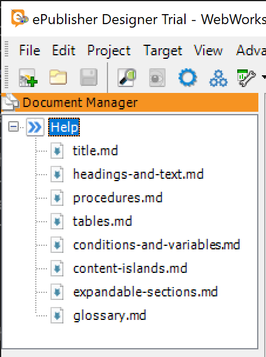
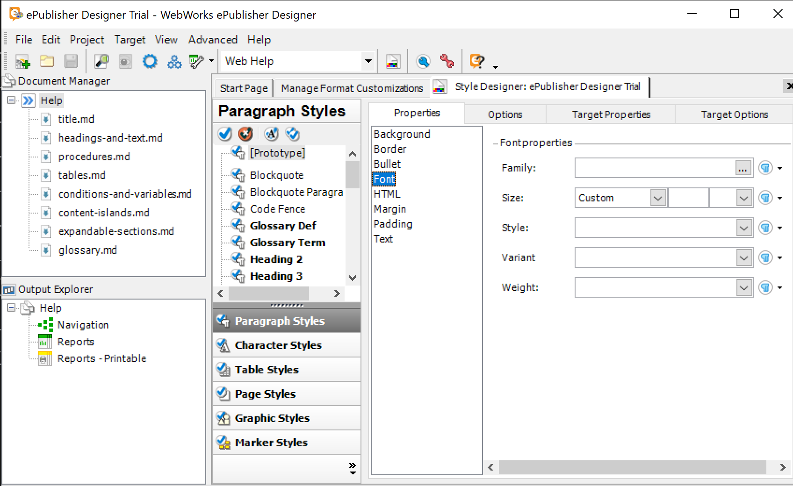
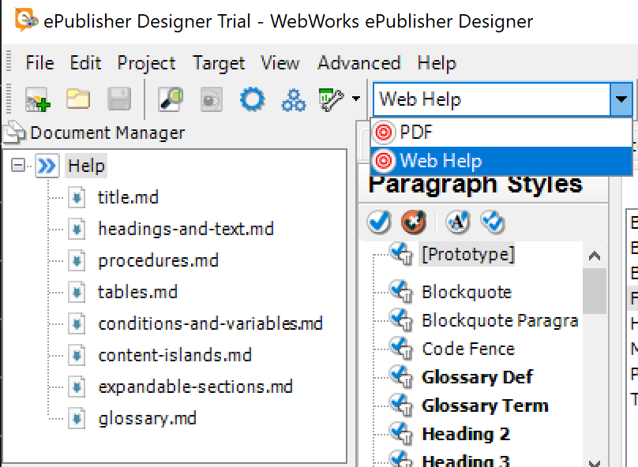
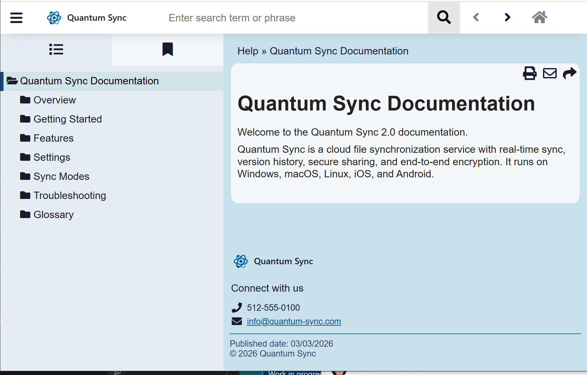

<!-- markers:{"Keywords": "designer, trial, getting started, customization, branding, stationery, style designer", "Description": "ePublisher Designer trial — customize branding, content rules, and output formats"}; #quick-start -->
# Quick Start

Design custom publishing experiences for DITA, FrameMaker, Word, and Markdown++ source documents. This trial uses Markdown++ for transparency and ease of evaluation — every concept here applies to all authoring environments.

<!-- #open-generate -->
## Step 1: Open & Generate

The **ePublisher Designer Trial** project opens automatically on first launch.

> **Returning user?** Choose **File > Open** and navigate to:
> `Documents\ePublisher Designer Projects\ePublisher Designer Trial\ePublisher Designer Trial.wep`

The Document Manager (left panel) shows your source documents already loaded. Generate the baseline output:

1. Verify the **Active Target** shows **Web Help**
2. Click **Generate All**
3. When the completion dialog appears, click **Yes** to view your output

<!-- style:Screenshot -->

<!-- #content-rules -->
## Step 2: Customize Content Rules

**Change the product name everywhere at once:**

1. Open **Target** > **Target Settings**
2. Find the **Variables** section — change `ProductName` from "Quantum Sync" to your product name
3. Click **Generate All** — every page now displays your product name

<!-- style:Screenshot -->

**Control what content appears:**

1. In the same Target Settings, find the **Conditions** section
2. Change `advanced` from **Visible** to **Hidden**
3. Click **Generate All** — advanced content disappears from the output

> **Tip:** Toggle conditions per target to publish beginner and advanced guides from the same source documents.

<!-- #brand-output -->
## Step 3: Brand the Output

**Change the color theme:**

1. Click **Format** > **View Differences** to see which files have been customized in the active target
2. Open `Formats/WebWorks Reverb 2.0/Pages/sass/_colors.scss`
3. Find `$qs_primary_brand_color: #0a4d8c` — change `#0a4d8c` to your brand color
4. Click **Generate All** — the entire web theme transforms

<!-- style:Screenshot -->

**Replace the PDF cover:**

1. Click **View** > **Project Directory** and open `Files`
2. Replace `pdf-cover.png` with your own cover image (keep the same filename)
3. Switch **Active Target** to **PDF** and click **Generate All** — your cover appears on page one

<!-- #style-designer -->
## Step 4: Explore the Style Designer

1. Open **View** > **Style Designer**
2. Notice that all styles inherit from **[Prototype]** — properties set on [Prototype] cascade to every style in the project
3. Select **[Prototype]** and change a property (for example, set **font-family** in the **Font** category)
4. Click **Generate All** — the change cascades to all styles that inherit from [Prototype]

<!-- style:Screenshot -->

Styles also support parent relationships, creating inheritance chains — set a property once to affect all children.

<!-- #multiple-targets -->
## Step 5: Generate Multiple Targets

Your project includes two configured targets: **Web Help** and **PDF**.

1. Switch **Active Target** to **Web Help** → click **Generate All** → view the branded web output
2. Switch **Active Target** to **PDF** → click **Generate All** → view the print-ready PDF

<!-- style:Screenshot -->

Conditions filter per target: `online_only` appears in Web Help, `print_only` in PDF. Same source, different outputs.

<!-- #done -->
## Done

You've customized content rules, branded the theme, explored style inheritance, and published to multiple formats — all from one set of source documents.

<!-- style:Screenshot -->

**Next:** Save your design as reusable Stationery, or keep reading to understand the architecture.

[Full documentation](https://static.webworks.com/docs/epublisher/latest/help/) | [Contact sales](mailto:sales@webworks.com)

---

<!-- #explore-more -->
## Explore More

You customized a complete publishing project. Here's how the pieces connect.

<!-- #what-you-just-did -->
### What You Just Did

The five steps map to Designer's control layers:

1. **Baseline output** (Step 1) — Generate from pre-configured source documents and Stationery
2. **Content rules** (Step 2) — Variables and conditions control what content appears and how it's personalized, per target
3. **Visual theme** (Step 3) — SCSS stylesheets and branding assets control the look and feel
4. **Style mapping** (Step 4) — The Style Designer controls how source styles map to output, with inheritance from [Prototype]
5. **Output targets** (Step 5) — Format configurations control the delivery medium

ePublisher separates *design* from *production*. Designer is where you create publishing standards. Express is where authors publish day-to-day against those standards — without needing Designer installed. The bridge between them is Stationery.

> **Beyond Markdown:** ePublisher processes DITA-XML, Adobe FrameMaker, and Microsoft Word source documents using the same Designer workflow.

<!-- #try-these-features -->
### Try These Features

Open your generated Web Help output and try each of these:

| Action                              | What to Notice                              |
|-------------------------------------|---------------------------------------------|
| Type in the search box              | Instant results with breadcrumb context     |
| Drag browser edge narrower          | Responsive reflow, TOC collapses to menu    |
| Click any image                     | Lightbox zoom at full resolution            |
| Click the Share widget              | Stable link to that specific page           |
| Switch to PDF target, regenerate    | Same content, print-ready PDF output        |

<!-- #stationery -->
### Create & Distribute Stationery

Stationery is the architectural core of ePublisher:

- Save your customized project as a Stationery template (`.wxsp` file)
- Distribute the Stationery to Express users across your organization
- Authors publish with your brand, rules, and targets — without needing Designer
- Update the Stationery once when standards change → all Express projects pick up the changes

<!-- #multiple-targets-detail -->
### Multiple Targets, One Source

Targets are not limited to different formats. Create multiple targets of the *same* format with different configurations — different conditions per product version, different branding per customer, or different variable values per edition.

Designer also supports EPUB, Eclipse Help, HTML Help, and more.

<!-- #ai-skills -->
### AI-Assisted Theme Design

A complete set of [AI skills for Claude Code](https://github.com/quadralay/webworks-claude-skills) is publicly available for ePublisher:

- Design color themes and generate SCSS palettes
- Configure style rules and content mappings
- Author and validate Markdown++ source documents
- Automate repetitive publishing tasks

<!-- #automap -->
### Automate with AutoMap

AutoMap adds command-line and scheduled publishing to your workflow:

- **CI/CD integration** — trigger builds from Jenkins, GitHub Actions, or any pipeline
- **Scheduled publishing** — regenerate on a timer without manual intervention
- **AI agent access** — CLI interface for autonomous documentation workflows
- **Headless operation** — no GUI required, runs on build servers

[Download ePublisher AutoMap](https://webworks.com/products/epublisher/download) — works with your existing Designer installation.

<!-- #product-family -->
### The ePublisher Product Family

| | **Express** | **Designer** | **AutoMap** |
|---|---|---|---|
| **Who it's for** | Authors publishing content | Teams controlling brand and design | DevOps automating builds |
| **What it does** | Generate output from Stationery | Create and customize Stationery | CLI and scheduled builds |
| **Source formats** | Markdown++, Word, FrameMaker, DITA | Same | Same |
| **Output formats** | Reverb 2.0, PDF, others | Same + full skin editing | Same |
| **Key capability** | One-click publish | Pixel-level design control | CI/CD and AI agent access |

[Download ePublisher Designer](https://webworks.com/products/epublisher/download) — includes Express for your authors.
