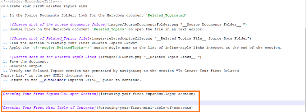

**Related Topic Links** are a good way to help your user find more relevant information and improve their experience.
This section shows how to create related topics links using the ePublisher work flow. As in the previous section,
you will read how to create **Related Topic Links**, make changes to the source documents via the instructions provided,
and then generate output to verify the changes were made correctly.

# Creating Related Topics Links

**Related Topics Links** are cross-references to other topics within your online content. **Related Topic Links** take
users to other topics that content creators believe will provide them with useful information about the topic they
are currently viewing. **ePublisher** can display related topics links as text in the generated output or as a related topics
 section below the content. In the sample **ePublisher Express Trial**, the stationery was
configured to display the related topics links in a section at the bottom of the content.

In this trial, Related topics links are created by applying the `<!--style: RelatedTopic-->` custom style name to inline-style links in your
source documents. When you generate output, the list of inline-style links will automatically display as related
topic links at the bottom of the page. 

<!--style: ProcedureTitle-->
To Create Related Topics Links 

 1. In your source document, find the topic for which you want to create a **Related Topics** section.
 1. Create a list of inline-style links for the topics you want to display in the **Related Topics** section at the bottom of the page.
 1. Add a comment above each link and apply the style name "RelatedTopic". 
    - Example Below: 
	  `<!--style: RelatedTopic-->` 
	  `[Expand/Collapse](#expand-and-collapse)`

<!--style: RelatedTopic-->
[Expand/Collapse](#expand-and-collapse)

<!--style: RelatedTopic-->
[Related Topics](#relatedtopics)

In generated output, a related topics section displays at the bottom of this topic. If you are reading this in the
output, you can see the related topics section at the bottom. If you are reading this section in the source
documents, you will see the links above this section. **ePublisher** will place the related topics at the bottom of
the page automatically. Go ahead and click the links in the output, they work. 

<!--style:Heading 1 Relevance-->
# Creating Your First Related Topics Link  

The previous section explains how you can create related topics lists by inserting a list of inline-style links
into a topic and then applying a `<!--style: RelatedTopic-->` custom style name. In this section, you will create your first
related topics section using the **ePublisher Express Trial** source documents and stationery.

<!--style: ProcedureTitle-->
To Create Your First Related Topics Link

 1. In the Source Documents folder, look for the Markdown document `Related_Topics.md`
 
    
 1. Double click on the Markdown document `Related_Topics` to open the file in an text editor. 
 
     
 1. Find the section "Creating Your First Related Topics Links" 
 1. Apply the `<!--style: RelatedTopic-->` custom style name to the list of inline-style links inserted at the end of the section.
 
    
 1. Save the document.    
 1. Generate output.
 1. Verify the Related Topics section was generated by navigating to the section "To Create Your First Related
Topics List" in the new HTML5 document set.
 1. Return to the **ePublisher Express Trial** guide to continue.

[Creating Your First Expand/Collapse Section](#creating-your-first-expandcollapse-section)

[Creating Your First Mini Table of Contents](#creating-your-first-mini-table-of-contents) 

If this is your first time generating this output, you should notice that there is no related topics section at
the bottom of this page. We did not want to have all the fun, so you are going to create a related topics
section on your own (with a little help from our instructions)

