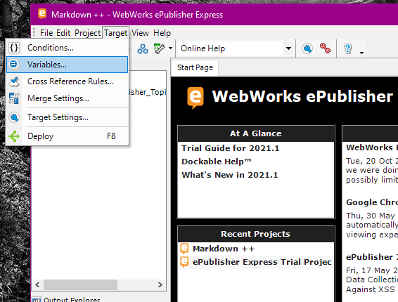

<!--#conditions-variables-->
# Conditions and Variables

**ePublisher Markdown++** also gives Markdown users the ability to use conditions and variables. This helps manage master files of content by allowing the content creator to be selective in what gets published. For example, You might have conditions that allow some content to be visable in a Premium feature's Manual, but then hidden in a Basic Feature's manual even thought all the content appears in the source documents. Variables allow content creator to put a string value as a place holder in the source documents and then enter a value when being published. **ePublisher Markdown++** has syntax to marker condition and variable areas in the source documents. **ePublisher** is the tool you use to control those areas when publishing. 

## How To Mark Conditional Text 

Conditions are written as a comment like most of the **ePublisher Markdown++** syntax. The difference is that Conditions must be a stand alone comment. Conditions also must have an end statement to show where the condition must stop. All **ePublisher Markdown++** syntax and Markdown syntax that apply to the content of the condition must be placed within the start and stop conditional sytax. 

For example take this piece of content: 

If I wanted to add a condition you would use the start and stop conditional syntax and wrap it around all of the content, including the [Custom Style Name](#Custom-Style-Names) `<!--style:Heading 1-->`

This is the syntax for conditions: 

Starting Statement - `<!--condition: NameofCondition-->`
Ending Statement - `<!--/condition-->`

**ePublisher Markdown++** conditions can also handle logical statements to determine whether a section gets published or not, based on the boolean truthiness concepts used in modern programming languages. If a statement in a condition tag evaluates to true, the section will be published. If the statement evaluates to false, the section is removed from the document before further generation steps are taken. The following rules apply when setting Condition values inside ePublisher:
  * A Condition set to Visible would be considered true.
  * A Condition set to Hidden would be considered false.
  * A Condition set to Use document value is considered unconfigured, and will be rendered regardless of any logical equation.

The following logical operators can be used in a Condition statement:
  * Whitespace between Condition Names can be used as a Logical AND.
  * Comma characters between Condition Names can be used as a Logical OR.
  * Exclamation Mark characters can be used before a single Condition Name as a Logical NOT

A few examples of Condition statements in use:
`<!--condition:Admins Teachers !Students-->` 
Be sure to submit all paperwork regarding registration prior to the first day of the school year. 
`<!--/condition-->` 
The above conditional text section will publish if Admins is Visible, Teachers is Visible, and Students is Hidden.

`<!--condition:Dev QC -->` 
This section is only visible to those who develop and test. 
`<!--/condition-->` 
The above section would render only if Dev or QC were set to Visible.

In the previous section of content, if we wanted to put a conditional statement around it called "PrintOnly" this is how it would look -

Once your condition is entered in to your source document, it will appear in **ePublisher** so you can manage it.

## How to Manage Conditional Text

**ePublisher** is the tool used to manage conditional text statements. In **ePublisher** click on the "Target" menu and click on the "Conditions.." menu item. 

In the **Conditions Management Tool**, you will see all the conditions listed under the "Name" column, options to manage them under the "Visibility" column and the abiltiy to allow conditions to pass through under the "Pass Through" column. Some options may not apply to your current situation, but as your documentation and workflow grows these options will become valuable to you.

 
<!--condition: PrintOnly-->
### Visibility Column

Under the Visibility Column, you will have 3 options to manage your conditions. "Visible" will show the condition in the published output. "Hidden" will hide the condition in the output. The third option, "Use document value" is not applicable for Markdown documents because text editors do not have the ability to manage conditions like Word or FrameMaker. This is why if you want conditional text in Markdown you will need **ePublisher** 
<!--/condition-->

## How to Mark Variables 

In **ePublisher Markdown++** you can use syntax as a place holder for a variable. The difference between the **ePublisher Markdown++** syntax for variables is that it will not be placed in a comment. This is so you can place a variable inline with content. Here is the syntax for variables: `$VariableName;`

Since this syntax is placed inline, the place holder will be shown in most Markdown previewers. If there is not a value entered in ePublisher, the place holder will show as well. To have the correct content show in the output, you must enter a value in the **Variable Management Tool**. 

The **Variable Management Tool** is under the same menu tab, "Target", as the **Conditions Management Tool**, and can be found the same way. 

In the **Variable Management Tool** you will see all variables listed under the "Name" column, options to use the document value, and in the final column an open text box to include a value. The "Use Document Value" column is not applicable for Markdown documents. Like Conditions, text editors do not have the ability to include variables. In the "Value" column you can enter content for a value. You can also include Markdown syntax if you choose to do so. 

For example, in this piece of content: 

**ePublisher Express** uses a **One-Click Publishing** workflow. This workflow gives content creators more time to spend on documentation by providing a streamlined and efficient publishing work flow which helps increases product value and customer loyalty. With the **One-Click Publishing** work flow, content creators can customize output by placing cues or markers in the source documents. We at WebWorks understand that this type of work flow sounds like it can be complicated as mediums change and documentation grows, but with **ePublisher** it can be simple and efficient in any environment. To accomplish this, we developed the unique concept of the **ePublisher Stationery**.

We can replace product names with variables to read like this: 

`$ProductE;` uses a **One-Click Publishing** workflow. This workflow gives content creators more time to spend on documentation by providing a streamlined and efficient publishing work flow which helps increases product value and customer loyalty. With the **One-Click Publishing** work flow, content creators can customize output by placing cues or markers in the source documents. We at WebWorks understand that this type of work flow sounds like it can be complicated as mediums change and documentation grows, but with `$ProductName;` it can be simple and efficient in any environment. To accomplish this, we developed the unique concept of the `$ProductS;`.

The three new variables will appear in the **ePublisher Variable Management Tool** like this:

Looking at the image above, adding the `**` syntax to the value `ePublisher Express` will bold the value in the generated output. 
