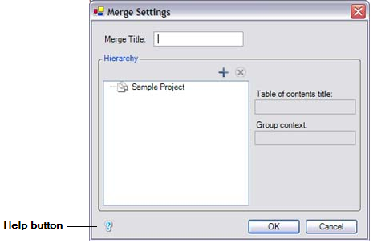

This section explains how you can create context-sensitive help topics in **ePublisher**. The Context-Sensitive
help feature in software products is a result of a combined effort from the developers of the product along with
the content creators for the product. This section is an example of what the content creators would need to
accomplish to do their part in bringing context-sensitive help to their users. You will create a context-sensitive
help topic using the sample **ePublisher Express Trial** source documents and stationery. For the trial, you will
only create the topic. In a real-world example, you would then hand that topic off to the developers, so they
could include the path at the right location in the product. 

<!--markers: {"TopicAlias":"IDH_CreatingContextSensitiveHelpTopics"}-->
# Creating Context-Sensitive Help Topics   

Context-sensitive help topics provide users with immediate assistance without requiring them to leave the context
in which they are working. They help answer questions like "What is this?" and "Why would I use this?", by
providing information for a particular object in the proper context. Many applications support context-sensitive
help by allowing a user to click on a Help button on an application window. When the user clicks on the Help button,
a context-sensitive help topic, related to the application, will display. 

For example, within an application, you might see the following window. 

 

If the user clicks on the Help button, then the context-sensitive help topic associated with the window displays. 

**ePublisher** allows you to create context-sensitive help topics through the use of TopicAlias markers and
specific Universal Resource Locator (URL).  The content creator inserts a TopicAlias marker in each
context-sensitive help topic they create. With TopicAlias markers, **ePublisher** can create a specific URL
address to make it easier to manage Context-sensitive help. Applications use the specific URL to determine which
topic to display when users click on the Help button on an application window.

In this source document, the first paragraph in this topic has a TopicAlias marker inserted in front of it. 
The topic ID specified in the TopicAlias marker is "IDH_CreatingContextSensitiveHelpTopics". 

The Stationery **Designer** assigned the appropriate context-sensitive behavior to the TopicAlias marker type in
the sample **ePublisher Express Trial** stationery. You can see this TopicAlias marker through the reporting
feature of **ePublisher**. Every time you have **ePublisher** generate output, it creates reports, so you can
easily manage aspects of your publishing work flow. If you take a look at the reports window (scroll down to the
bottom of the Output Explorer window) You can see, we give you two types of reports: 

 

The first section (in green) is for in-product reporting. Clicking these links will display the output in the log
window, and give you access to helpful links. The second section (in yellow) is the same report with the same
information. It is just formatted in HTML to make the information print friendly. It will contain the same helpful
links. 

To view the TopicAlias marker, use the "Topics Report" in the printable section. 

Clicking on the Topics Report will open a new browser window. The description section lists the actual Topic ID.
Developers use the path ePublisher creates, NOT the Topic ID, to trigger the help topic when a user would click
on a "?" or some other icon your company has chosen to represent help guides. You can experience that functionality
by clicking on the word "Output" under the "Links" section in the report. Clicking will trigger the page of the
path. 

ePublisher list all paths in a single file that you can hand over to your developers. Located in the same area as
the reports, this file is located more to the top of the list of files. The name of the file is always the same.
If you would like to see the paths ePublisher created, open the file "url_maps.xml".

  

Using **ePublisher** to generate your TopicAlias markers is the simplest way to manage context-sensitive help in
your product. As long as the name of the marker never changes, the path generated by **ePublisher** will never
change, giving you peace of mind when it comes to your context-sensitive help. The following steps go over how to
create and place TopicAlias markers. 

<!--style:ProcedureTitle-->
###### To Create a Context-Sensitive Help Topic 

1. Locate your context-sensitive help topic.
1. Begin a comment line above the help topic.  
1. Insert the TopicAlias marker using this format
   - `<!--markers: {"TopicAlias":"TopicID"}-->`. 
1. Save the document.

For example, in this document, a TopicAlias marker is inserted in front of the first Title `# Creating Context-Sensitive Help Topics ` The
topic ID specified in the TopicAlias marker is `IDH_CreatingContextSensitiveHelpTopics`. Here is what it looks like in the source document:

`<!--markers: {"TopicAlias":"IDH_CreatingContextSensitiveHelpTopics"}-->`
`# Creating Context-Sensitive Help Topics` 

<!--style:Heading 1 Relevance-->
# Creating Your First Context-Sensitive Help Topic 

The previous section explains how you can create context-sensitive help topic by inserting a TopicAlias marker and
specifying a topic ID as the marker text. In this section, you will create your first context-sensitive help topic
using the **ePublisher Express** Trial source documents and stationery.

<!--style:ProcedureTitle-->
#### To Create Your First Context-Sensitive Help Topic 

1. In the Source Documents folder, look for the Markdown document `Context_Sensitive.md`.
2. Double click on the Markdown document *Context_Sensitive.md* to open the file in an text editor. 
   
   
3. Find the section "Creating Your First Context-Sensitive Help Topic". 
4. Insert a TopicAlias marker above the procedure title,"Creating Your First Context-Sensitive Help Topic", using the proper syntax in a comment. 
5. Specify`IDH_CreatingYourFirstContextSensitiveHelpTopic` as the topic ID for the topic by typing this text in the "TopicID" field for the marker.
   - Example Below 
   `<!--markers:{"TopicAlias":"IDH_CreatingYourFirstContextSensitiveHelpTopic"}-->`
6. Save this source document.
7. Verify that this topic marker now displays the **Topics Report** by launching the report from the Output
Explore in the **ePublisher Express** Project.
8. Verify that the link works by clicking "Output" in the **Topics Report**.
9. Return to the **ePublisher Express** Trial Guide to continue.

