Welcome to Your ePublisher Express Trial
========================================

Thank you for your interest in ePublisher. This guide will help you to understand the ePublisher system and how to use it to customize documentation delivery to your customers.  This trial includes a pre-configured ePublisher Express project and source documents. 

> Before starting **DOCUMENTS WILL NEED TO BE ADDED** to this project. Click [here](#pID0E0JI0HA "Welcome to Your ePublisher Express Trial") to learn more.

This guide is organized into 4 sections: 

- **[The ePublisher System](#pID0E0RI0HA "Welcome to Your ePublisher Express Trial")** – This section describes the ePublisher system. Knowing the elements within the system will help you to understand what is going on inside ePublisher while it is creating your HTML5 document set.  

- **[Introduction to the ePublisher Interface](#pID0E0IH0HA "Welcome to Your ePublisher Express Trial")** – In this section, we will show you the different areas of ePublisher. We have used screens shots with a brief description to help you identify each section. Becoming familiar with the interface of ePublisher will help you move quickly through the trial. 

- **[Introduction to Reverb 2.0](#pID0E0DG0HA "Welcome to Your ePublisher Express Trial")** – In this section, we will show you the design of ePublisher’ s advanced HTML5 document set. This section will help you understand the customer experience when using a document set generated with ePublisher.

- **[Using the ePublisher System](#pID0E0SE0HA "Welcome to Your ePublisher Express Trial")** – This section has a list of tasks to perform using the ePublisher system. Performing these tasks will show how to leverage a customized [stationery](#pID0E0XH0HA "Welcome to Your ePublisher Express Trial") to increase the effectiveness of your documentation.

- **[Search Showcase](#pID0E0AC0HA "Welcome to Your ePublisher Express Trial")** – The Search Showcase section focuses on the advanced search features of **Reverb 2.0**. You will see a list of features, brief descriptions and instructions on how to implement them.   

Navigation
==========

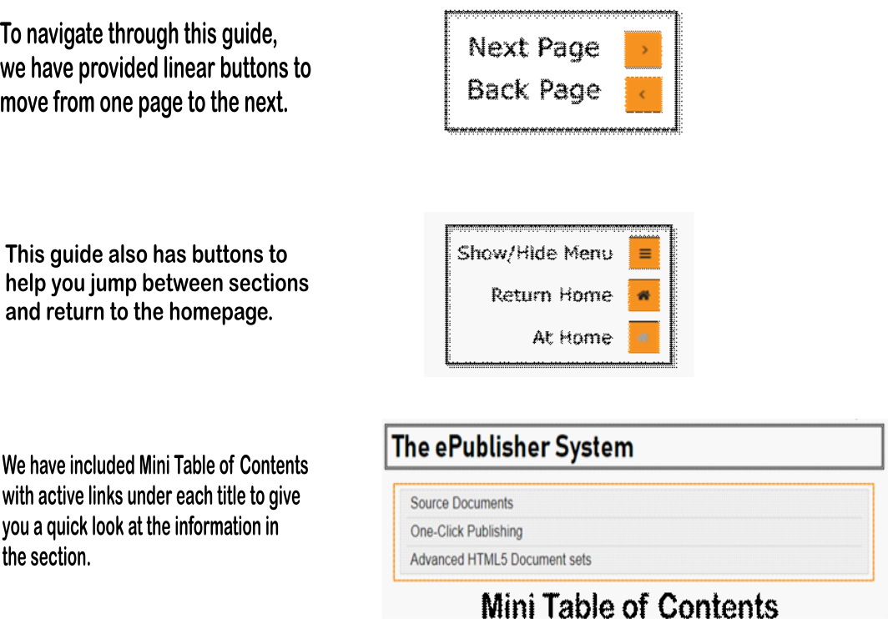

Throughout this guide, you will see “ePublisher Express Trial Exercise:” followed by a list of tasks meant for you to perform. To make sure you can complete all activities, you’ll need to follow each step.

The ePublisher System
=====================

Source Documents
================

The ePublisher systems use paragraph and character styles or output classes in the source documents to identify areas of content. Once an area has been identified, the behavior of that content can be controlled in any medium, e.g. HTML5, PDF..., produced by ePublisher. 

The trial source documents provided have a preset of paragraph and character styles or output classes. You will use the source documents to complete the tasks listed in the “Using the ePublisher System” section. The trial source documents also include more detail instructions on how to perform the task. 

Finally, the “My Edits” section is where you can alter or create your own content and see examples of how to incorporate different media into your HTML5 document sets. However, while editing in the trial source documents, introducing new paragraph and character styles or output classes are not recommended.  

If you’d like to customize ePublisher with your own paragraph and character styles or output classes, click on the link “Learn About Designer” in the Next Steps section of the ePublisher Express **[Working Area](#pID0E0HH0HA "Welcome to Your ePublisher Express Trial")** after this trial.

How to Add Documents to Your ePublisher Express Trial
=====================================================

For this trial, we have provided source documents for you to use. ePublisher Express uses an ePublisher Stationery as a style guide and to provide instructions on the look and feel of the output. The ePublisher Stationery can be customized to your own style guide information using ePublisher Designer. This trial has a pre-configured stationery designed to show you the [One-Click Publishing](#pID0E0XH0HA "Welcome to Your ePublisher Express Trial") workflow ePublisher can provide and how it can benefit you in your day-to-day work. The pre-configured stationery is customized for the source documents we provided. This section will show you how to choose the input file format you would like to work with during this trial. 

Launch ePublisher Express and find the View tab at the top of the user interface. 

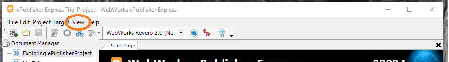 

Left click on the View tab and select the option “**Project Directory**.”

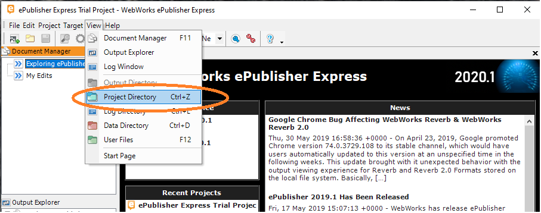

This will open a new window where all the folders and files for the ePublisher Express trail are listed. Open the folder labeled “**Source-Docs**” and you will see folders with different input formats listed. Pick the format you would like to use by opening the corresponding folder. 

Once you have opened the format folder, you will see file names that correspond with the group names in your Express project. Drag and drop the corresponding files to the ePublisher Express group one at a time. 

If you would like to work with several formats, pick your first one and after those documents have been added to the project you can pick another. 

To get back to the start page click the home button  on the tool bar. 

 

 

One-Click Publishing 
=====================

One-Click Publishing supports optimal work flow through speed and accuracy. You can create, generate, deliver through a simple work flow that is agile, flexible and intelligent. With less time focused on publishing, you have more time to create your message.  

To simplify work flow, WebWorks uses the concept of stationery. The ePublisher stationery is an electronic template that contains your style guide information and that acts as your publishing assistant taking specific instructions and then executing them every time it delivers content. 

Every ePublisher Express project is synchronized to stationery. ePublisher Express reads the content from the source documents, gets instructions from the synchronized stationery and then publishes. The ePublisher process is triggered with a single click of a button. 

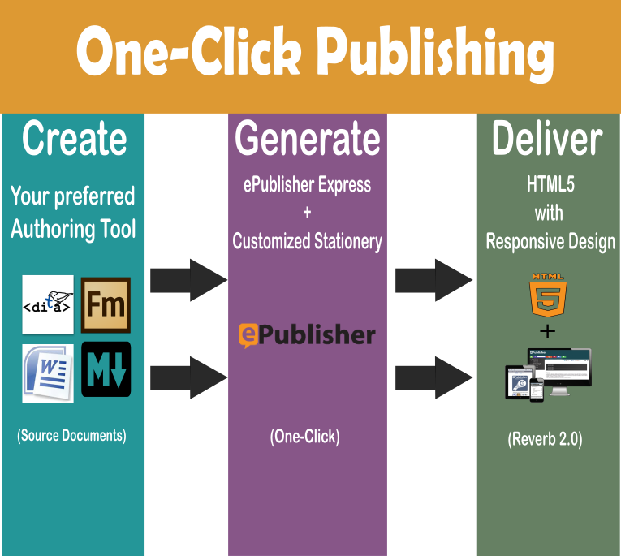

For this trial, we have built a stationery at WebWorks lab customized to the trial source documents. When you installed the trial, it loaded an ePublisher Express project, source documents and synchronized to that stationery. Now you get to work on those source documents, just like you would work on your own, and by following our instructions, you will see the power of One-Click Publishing.

Advanced HTML5 Document Sets and Dockable Help™ 
================================================

HTML5 was designed to deliver almost any feature in an online help system without requiring additional software such as browser plugins. It can use almost any type of media assets, such as audio, video or animation to enhance your message.

ePublisher converts source documents into HTML5 one page at a time. Once all the HTML5 pages have been created, ePublisher adds extra coding to make the pages responsive. It then packages the responsive HTML5 pages into a single document set we call **Reverb 2.0**. 

**Reverb 2.0** is a versatile output that can be housed and displayed anywhere HTML5 pages can live. We have also added some technology that enables **Dockable Help**™.

This guide was generated in **Reverb 2.0** and **Dockable Help**™ is the technology we are using to deliver it to you. As you go through the guide, you will see some of the benefits to **Dockable Help**™ and the impact it can have on your customers.    

   

Introduction to the ePublisher Interface
========================================

Working Area
============

ePublisher’s user interface is a simple layout. The largest area is the **Working Area**.  The **Working Area** displays logs, reports, previews and other helpful information when working with ePublisher. 

Document Manager
================

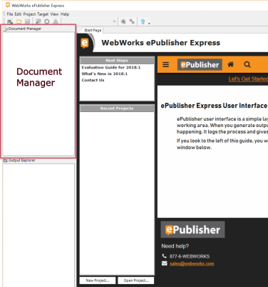

The **Document Manager** shows the source files used when generating to **Reverb 2.0**. This window works a lot like File explorer with a couple of additional features. You can double-click on a document to open it with the native program. For this trial, you will open trial source documents from this window.

Output Explorer
===============

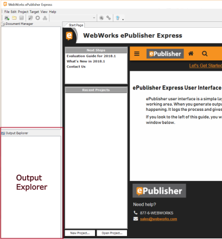

The **Output Explorer** window lists all the HTML5 pages ePublisher created for a single **Reverb 2.0** document set. You can view the entire set recently generated by double-clicking the index.html file in the **Output Explorer** window. You can also view the location of the actual file by right-clicking in the **Output Explorer**. 

The **Output Explorer** also has links to the reports generated by ePublisher. They can be found below the links to the HTML5 pages. 

ePublisher Express provides two formats for all the reports generated. The first set of reports will open in the ePublisher **Working Area** and will have helpful links to identify the item and whether it is in the source documents or the **Reverb 2.0** document set. The printable section of reports opens in a new browser when clicked. The HTML file will have the same information in a printable format.   

**Links to files and reports will only be available AFTER ePublisher generates the selected target.  **

Active Target Window
====================

The **Active Target** window displays the current target. Target names are a way to manage several HTML5/PDF document sets. They are customizable and should be descriptive, so each team member will understand the purpose of that target by looking at the name.

## ePublisher Express Trial Exercise: Selecting Neo As the Active Target

1. Left-click the drop-down arrow next to the **Active Target** window

2. Read the 4 targets listed in the drop-down menu:

   - **PDF-XSL-FO**

   - **WebWorks Reverb 2.0 (Classic)**

   - **WebWorks Reverb 2.0 (Metro)**

   - **WebWorks Reverb 2.0 (Neo)**

3. Select target **WebWorks Reverb 2.0 (Neo)**

Each target listed is **WebWorks Reverb 2.0**. The content in brackets displays the name of the layout design. We have given you three different layouts to show you some of the flexibility **Reverb 2.0** has for design. We have also provided a PDF output. ePublisher gives you the ability to manage all your outputs in one project. We list the target as PDF-XSL-FO because that is the engine ePublisher uses to generate the PDF. 

For now, stay with **WebWorks Reverb 2.0 (Neo)**, so it shows in the **Active Target** window. 

Introduction to Reverb 2.0
==========================

Generating Your First HTML5 Full Document Set 
==============================================

Getting started
===============

The second exercise of the trial experience is generating a HTML5 document set. After completing this step, you will have an example HTML5 document set to look at and interact with. Most of the work has been done, so all you need to do is push a button. The next exercise will walk you through that, so you can understand what is happening. 

If **WebWorks Reverb 2.0 (Neo)** is not in the **Active Target** window, go to the [Active Target Window](#pID0E0UG0HA "Welcome to Your ePublisher Express Trial") section to learn how to select it. 

## ePublisher Express Trial Exercise: Generating Your First HTML5 Document Set 

1. Look for the **Generate All** icon at the top left corner of the ePublisher Express interface. 

2. Before you click the **Generate All **button, there are some items you should be aware of during the generation process.

   1. A log window tab will appear over the trial guide

   2. A progress bar will appear over the log window tab

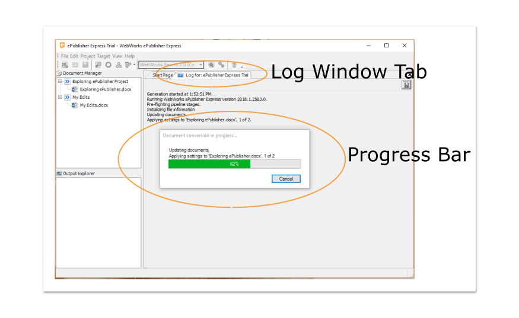

3. After generation is complete, you will be asked if you want to view the generated output:

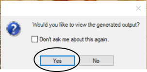

4. Clicking **Yes** will open the HTML5 document set in a default browser and return the Trial Guide.

5. Click the **Generate All** button now and then click **Yes** to view the output and return to this guide. 

The Design of Reverb 2.0
========================

For this section, you will be looking at the HTML5 document set you generated in the previous ePublisher Express Trial Exercise. Take a moment to look at the results. 

Everything that you see was created by ePublisher. It scanned the trial source documents for content, received its instructions from the trial stationary and then generated the target you selected. The output you published with one click is **WebWorks Reverb 2.0 (Neo)**. This is a default output and all the features you see come out of the box. The design of Reverb is fully customizable and can be changed to fit your needs.

# Search Box

The **Search Box** is located at the top of the page. Often customers prefer just to type in a search key word to get started. 

# Search Filter Menu

To the left of the search box is the **Search Filter Menu**. It displays search filters, so customers can narrow search results. ePublisher creates these filters from the group names in the Express project. If you look in the **Document Manager** window, you will notice the two groups that now appear in the **Search Filter Menu**.

# Search Button

The **Search Button** is to the right of the **Search Box**. This button makes it easy for a customer to move back and forth from search results to the last viewed page.

 

# Navigation Arrow and Home

To the far right of the **Search Box** are the left and right **Navigation Arrows** and the **Home** button. The **Navigation Arrows** move in a linear direction advancing a single page per click. The **Home** button will return to the first page in the set. 

# Table of Contents Menu button

At the very left end of the toolbar is the **Table of Contents** **Menu** button. Reverb is responsive and will display content on any device and any screen size. When it detects smaller screen sizes, it will hide certain features and show the most relevant information to the customer. If the customer is on a smaller screen and the Table of Contents is hidden, they can touch this icon to reveal the table. You can see this feature now by left-clicking the **Table of Contents Menu** button in the guide or in your generated HTML5 document set.   

# Table of Contents and Content Display Area

The mid-section of the layout contains the **Table of Contents** to the left and the **Content Display Area** to the right. As a content creator, you will have a lot of control over these fields just from your source documents. For the trial, we have titles set as a level one **Table of Contents** entry, and we have a solid page break after each one in the **Content Display Area**. These options are customizable. When we go through the tasks in “Using the ePublisher System,” you will look for the changes to the output in these areas.

# Footer

**WebWorks Reverb 2.0** by default generates a **Footer** at the end of each page. This **Footer** has a customizable look as well as behavior. The default look we chose has a company logo, link, number and email address left justified. The behavior of the **Footer** itself is dynamic, meaning that it will reposition itself depending on the length of the information in the **Content Display Area**.

Different skins will have different layouts and behaviors. To view them simply go to the **Active Target** window, select a different target, and click the **Generate All** button. 

Using the ePublisher System 
============================

The next four sections are dedicated to practical experience with the ePublisher system. The four tasks are just a small sample of what you can do with ePublisher. 

To perform a task, start here in the ePublisher trial guide to review examples and steps. Then, you’ll go to the HTML5 document set you generated earlier for instructions on how to edit the trial source documents. You will then come back to this ePublisher Express project to modify the trial source documents. The best way to access the trial source documents is through the **Document Manager**.

Each list of steps in the generated HTML5 document set will have the file name of the source document you need to open. Look for that file in the **Document Manager** and then double click to open the file. Don’t worry, we are going to take you step by step through the process. 

Here are the tasks to complete: 

- [TASK 1: Expand/Collapse Sections of Content](#pID0E0AE0HA "Welcome to Your ePublisher Express Trial") - You will mark sections of content in the source documents that will appear as an expand/collapse section within the generated output.

- [TASK 2: Related Topics Links](#pID0E0LD0HA "Welcome to Your ePublisher Express Trial") - You will mark sections of content in the source documents to appear as related topic links at the bottom of a page in the generated output.

- [TASK 3: Context-Sensitive Help Topics](#pID0E0BD0HA "Welcome to Your ePublisher Express Trial") - You will add markers to the source documents and then verify the TopicAlias marker generated by viewing ePublisher's Topics report.

- [TASK 4: Mini Table of Contents](#pID0E0QC0HA "Welcome to Your ePublisher Express Trial") - You will mark a title to have ePublisher generate a mini Table of Contents below the title in the generated output.

- [The My Edits Section](#pID0E0HC0HA "Welcome to Your ePublisher Express Trial") - This trial has a section created for you to experience the One-Click publishing work flow with content you create. You will be able to apply the skills you learned from the previous task as well as see examples of how to embed videos for output.

These are just some of the powerful features you have available to you in ePublisher. 

You can find detailed steps for each task in the HTML5 document set by searching for “Creating Your First &lt;name of the task&gt;” section. For example, the first task is called “Expand/Collapse Sections of Content.” You can find the steps for this by searching “Creating Your First Expand/Collapse Section.”

If you are specifically interested in one feature over the others, just click the link above to move to that section. 

TASK 1: Expand/Collapse Sections of Content
===========================================

For the first task, you are going to mark an area of content in your source documents to act as an Expand/Collapse field in the HTML5 document set. To start we are going to give you some directions. You can find these directions in the first HTML5 document set that you generated. If you have not generated the HTML5 document set, go [here](#pID0E0CG0HA "Welcome to Your ePublisher Express Trial"). 

To view the help set, click on the “View” tab in the menu bar and select “Output Directory”

When you view this folder, you will see the complete HTML5 document set that ePublisher generated in the previous step. This folder would be deployed to a web server or production server. For now, just double click on the file “index.html”. 

In the HTML5 document set, search for the term “Creating Expand/Collapse Sections” and click on the second result.

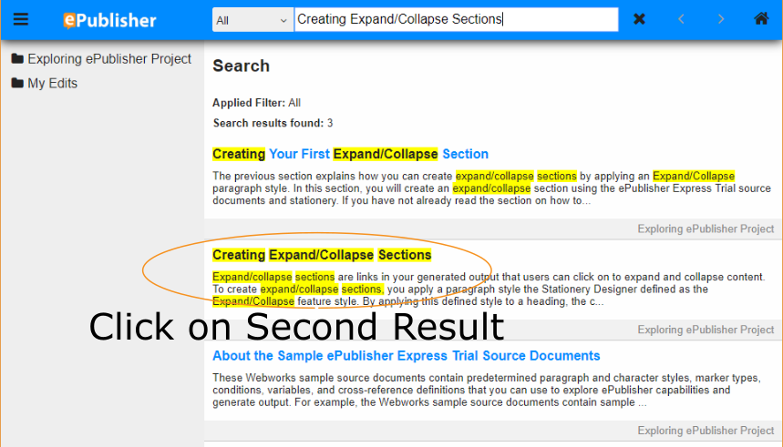

At the bottom of the page, you will see "To create expand/collapse sections" and notice an arrow at the end. Clicking on the arrow expands/collapse the section allowing you to either hide or reveal the steps involved.

Section Closed

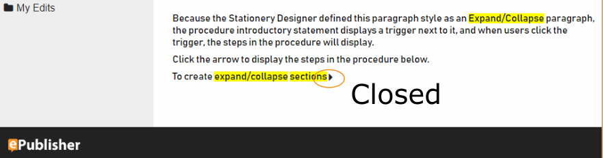 

Section Open

The next page in the HTML5 document set is “Creating Your First Expand/Collapse Section.” Follow the instructions on how to modify the trial source documents to create your first expand/collapse section. Following the instructions in the HTML5 document set will make it easier when editing the source documents. Once completed, return to this guide to complete the next task. Move to the next page in your document set by clicking the left navigation arrow.  

TASK 2: Related Topics Links
============================

Ok, now you should be getting an idea of how the ePublisher system works. Let’s find the “Related Topics” section by searching for “Creating Related Topics Links” in the HTML5 document set.

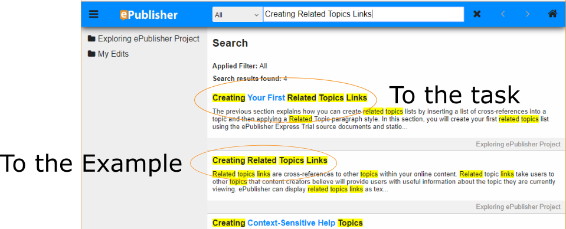

The first result will be the steps you need to create your first Related Topics section. If you would like a little more information about Related Topics and to view an example, then click on the second search result and navigate to the bottom of the page.

At the bottom of the page, there are two related topics, “Expand/Collapse” and “Related Topics.” In the source documents, these are cross-references that appear at the bottom of the last paragraph on the page. The marker **RelatedTopic** was applied to the cross references. How to apply the marker depends on the type of authoring tool you are using. The generated HTML5 document set will have instructions specific to your authoring tool. 

When ePublisher came across the marker **RelatedTopic,** it added the Related Topics section and links to the HTML5 page. It also inserted the “Related Topics” heading at the top of the section.

Use the navigation arrow to move to the next page in the generated HTML5 document set. Follow those instructions to create your first Related Topics section. Once complete, you can return to this guide. 

TASK 3: Context-Sensitive Help Topics
=====================================

ePublisher has features to help content creators collaborate with other departments. In this next section, we will mark an area for ePublisher to create a **TopicAlias** to allow for Context-Sensitive Help Topics within a product. 

Context-Sensitive Help Topics relate to a specific function within a product. While using that product, help can be triggered with the click of a button, revealing information that relates to that function or area of the product. 

Both developers and content creators need to work together to bring this feature to their customers. ePublisher helps with this process by generating **TopicAlias** markers, which are paths to a specific location in the help documentation set. 

In your generated HTML5 document set there is a **TopicAlias** marker. Looking at the Topics Report will verify that the marker was created. In the ePublisher Express Trial project, scroll down to the reports area in the **Output Explorer** window. You will see two sections of reports, standard and printable. The standard reports links are green and when clicked will display inside the ePublisher **Working Area**. For this trial, we are going to have you click on the Topics Report in the yellow or Printable section to open a separate HTML window. Go ahead and double-click on the Topics Report.

In the browser, you now see the **TopicAlias** marker in the “Description” section. You can verify the section the marker points to by clicking “Output.” Clicking “Output” mimics the experience your customer would have when clicking the trigger point in the product. 

That trigger point could be a question mark or some other icon, but when clicked the section this path leads to will be displayed. Go ahead and click “Output” if you have not already.

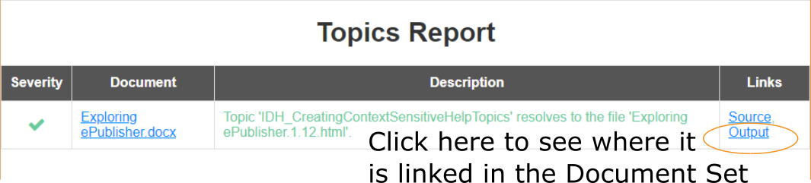 

You are ready to insert your first **TopicAlias** marker. In the generated output, search for the section “Creating Context-Sensitive Help Topics.”** **Click on the first search result and complete the task. Once completed, return to this guide for the next and final task. 

TASK 4: Mini Table of Contents
==============================

ePublisher has several features that help deliver content where viewing space is limited.  One of these features is Mini Table of Contents (TOC). Mini TOCs appear underneath a title. It is an area that lists the subheading in the section and provides links to those areas.

Mini TOC Example: 

You have seen some examples of Mini Table of Contents through this guide. They are ideal for smaller screens and great for mobile outputs 

Search for “Mini Table of Contents” in the HTML5 document set. Click on the first result and follow the instructions to create a Mini TOC. Once completed, come back to this guide so you can go through the Search Showcase to learn about the advanced search features of **Reverb 2.0**.

The My Edits Section    
========================

This section of the output is for you to use ePublisher with your own content. We have provided an area in the source documents, so you can see the styling information available to use with your content. 

Once you complete the trial and purchase ePublisher Designer, you will be able to customize a stationary specific to your styling information. 

This section also highlights how ePublisher handles media. ePublisher can work with the native input function of your authoring tool, but it also allows a pass-through function as an alternative way to customize how media appears in your HTML5 document set. For this to work properly, you will need to rely on the style names provided for you in the Trial source documents.

That example is in the “Try Adding Some Pictures or Links to Videos” section. 

  

Search Showcase
===============

The advanced search feature in **Reverb 2.0** creates a controlled search experience. In this section, we are going to highlight some of those features, but first, we are going to have you set up your source documents for the showcase. 

Getting the Source Documents Ready
==================================

Next is a list of the **Advanced Search Feature** in **Reverb 2.0**. Follow the directions in each section to see how they work and how they can improve the customer experience. 

## ePublisher Express Trial Exercise

Let’s have you add a few items in the “My Edits” section of the source documents so you can try all the search features available. Here is a list of items we would like for you to add:  

1. Open the “My Edits” section of the Trial source documents

2. Add one or two paragraphs of content you are familiar with, so you can try multiple search entries and see the different results. 

3. Add a link to a PDF document on your desktop. Make sure the PDF has some text so you can search on the terms in the PDF.  

4. Add a link to an external website. Any site will do, just make sure that like the PDF, there is some text, so you have some search terms available to use.

5. With those items in the source documents, save your changes.

6. In the **[Active Target Window](#pID0E0UG0HA "Welcome to Your ePublisher Express Trial")** of the ePublisher Express project, select the target labeled “**WebWorks Reverb 2.0 (Neo)**

7. Click the **[Generate All](#pID0E0CG0HA "Welcome to Your ePublisher Express Trial")**** **button and view the output by clicking yes.

 

Real-time search results
========================

**Reverb 2.0** gives your customer access to the fastest search results possible. As they type in keywords and phrases results will populate instantaneously and progressively refine while they continue to type. 

In the HTML5 document set, type the phrase “Creating Related Topics Links.” Watch the results narrow down to a select few. This is what it looks like to put relevant information in front of your customer in real-time speed. 

By having this feature, you can be sure that the first experience your customer has with the search capability of your online help is fast and accurate, no matter where they are in the content. 

Relevance Ranking
=================

**Relevance Rankings** use the ePublisher system to identify priority content, so you can push that content to the top of your customer’s search results. Let’s show you how it works. 

From any page within the output, search for the word “brown.” Now look at the top two entries. They are titled specifically to give you a hint as to what is going on. In the top result, the search term “brown” only appears once. The second result has “brown” multiple times. A typical search engine would have put the result with multiple entries at the top of the list. We are using **Reverb’s Relevance Ranking** system to push the first result to the top.

With **Reverb 2.0** **Relevance Ranking**, you customize the search experience for your customers.

Keyword Markers and Synonyms
============================

**Reverb 2.0** also gives you the ability to match synonyms to keywords, optimizing search results. 

Years back, ePublisher Designer was called ePublisher Pro. We put entries into the synonym list that correlate Pro with Designer. This way if someone were to put in Pro by mistake the results for Designer would still show. 

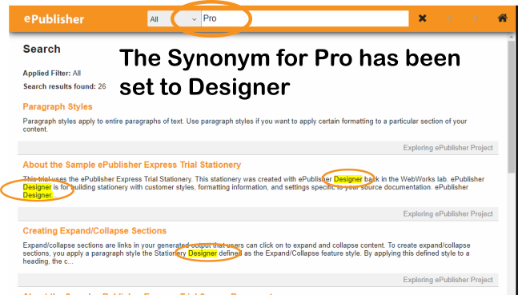

Go ahead and type the word “Pro” with a space at the end in the **Search Box**. You can also include “ “ around the Keywords if you would like to see the behavior. 

As you can see from the highlighted text in the search results, we include Designer with the results to help guide the users to the areas relevant to the information they want. 

Spotlight Search
================

We know that an issue with documentation sets today is breaking through content silos. Content silos are a result of several different situations, but they all have the same affect. There is content that is valuable to the customer but exists outside the document set they are currently in. This senerio makes it almost impossible to let your customer know about the other resources. 

**Spotlight Search** is WebWorks’ solution. If you remember back at the beginning of this section, we asked you to put a couple of links in the source documents. One to a PDF on your desktop and then one to a website. 

Search for a term that appears in the PDF, and then search for a term that appears on that website. Check out the search results, even though you are searching inside of the HTML5 document set that you generated, ePublisher indexed the content of those outside resources so they would appear in the results.

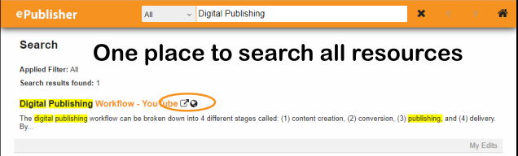

**Spotlight Search** also has a special set of icons for results outside of the document set.

**Spotlight Search** also gives you the ability to rank and even create titles and summaries for your outside resources, through our **Baggage File** in ePublisher Designer. 

Next Steps
==========

Congratulations! You have completed the ePublisher Express Trial. We hope it gave you a new understanding of ePublisher and how content works within the WebWorks ePublisher work flow. 

We understand and believe in the value of documentation. Sharing knowledge helps people improve, and at WebWorks we feel helping people to better themselves is one of the noblest acts. We would be honored to help you in that pursuit. 

If you feel ePublisher is a match for your needs, or if you have more specific questions about ePublisher Express, please contact a WebWorks Sales Representative.  

Our Representatives can also help you if you have questions about customizing a stationary or outputs through ePublisher Designer. WebWorks Sales Representatives can be reached at [sales@webworks.com](mailto:sales@webworks.com), or call us at 887-6-WEBWORKS (877) 693-2967. 

[\_top](#pID0E0CJ0HA "Welcome to Your ePublisher Express Trial")

